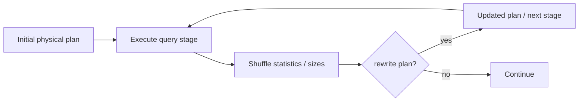

# Diagram — adaptive query execution (AQE) loop

How **runtime** statistics feed back into **shuffle** and **join** choices. This is a **logical**
loop, not a single thread.

## Explanation

With `spark.sql.adaptive.enabled=true`, Spark can **re-optimize** after **query stages** complete
and real **sizes** are known. Typical effects: **coalesce** small shuffle outputs, **switch** join
**strategy**, or **split** skewed shuffle partitions.

## AQE decision loop (simplified)

## Production interpretation

- **“AQE is on” is not evidence** — check the **final** plan in the **SQL** UI or history for
  `AdaptiveSparkPlan` and **annotated** joins / shuffles.
- **Bad surprises:** coalesce to **too few** partitions (giant output files) or a **broadcast** that
  OOMs because the **runtime** estimate was still wrong.

**Pairs with:** [`../docs/book/06-adaptive-query-execution.md`](../docs/book/06-adaptive-query-execution.md)
