# Diagram — Broadcast Hash Join vs Sort-Merge Join

The two most common join strategies in production Spark, side by side. Reading this diagram is the prerequisite for diagnosing 60% of join-related performance incidents.

## Explanation

A **broadcast hash join** sends the small (build) side to every executor as a hash relation. The large (probe) side is scanned in place; each task probes its partition against the local hash table. There is no shuffle on the large side.

A **sort-merge join** shuffles both sides by the join key, sorts each side within partitions, and merges sorted streams to find matches. Both sides take a full shuffle and sort; this is the price of joining two large datasets.

Spark picks broadcast when the build side fits under `spark.sql.autoBroadcastJoinThreshold` (default 10 MB). It picks sort-merge for everything else, with rare exceptions for shuffled hash join.

## Mermaid Diagram

```mermaid
flowchart TB
    subgraph BHJ["Broadcast Hash Join (small side fits)"]
        direction LR
        Bsmall["Small side (e.g. 20 MB dim)"]
        Bbig["Large side (e.g. 3 TB fact)"]
        Bbroadcast["BroadcastExchange<br/>send hash table to all executors"]
        Bjoin["BroadcastHashJoin<br/>per-task probe against in-memory hash"]
        Bout["Output"]

        Bsmall --> Bbroadcast
        Bbroadcast -->|hash relation copied to every executor| Bjoin
        Bbig -->|scan in place, no shuffle| Bjoin
        Bjoin --> Bout
    end

    subgraph SMJ["Sort-Merge Join (both sides large)"]
        direction LR
        SLeft["Left side (e.g. 3 TB orders)"]
        SRight["Right side (e.g. 600 GB profile)"]
        SExLeft["Exchange<br/>hashpartitioning(key)"]
        SExRight["Exchange<br/>hashpartitioning(key)"]
        SSortLeft["Sort by key"]
        SSortRight["Sort by key"]
        SJoin["SortMergeJoin<br/>merge sorted streams"]
        SOut["Output"]

        SLeft --> SExLeft
        SRight --> SExRight
        SExLeft -->|shuffle by key| SSortLeft
        SExRight -->|shuffle by key| SSortRight
        SSortLeft --> SJoin
        SSortRight --> SJoin
        SJoin --> SOut
    end

    classDef small fill:#2ca02c,stroke:#2ca02c,color:#ffffff
    classDef big fill:#1f77b4,stroke:#1f77b4,color:#ffffff
    classDef shuffle fill:#ff7f0e,stroke:#ff7f0e,color:#ffffff
    classDef sort fill:#9467bd,stroke:#9467bd,color:#ffffff
    classDef join fill:#d62728,stroke:#d62728,color:#ffffff

    class Bsmall small
    class Bbig,SLeft,SRight big
    class Bbroadcast,SExLeft,SExRight shuffle
    class SSortLeft,SSortRight sort
    class Bjoin,SJoin join
```

## How To Use This Diagram In The Relevant Chapter

Use this diagram in [Chapter 4 — Joins](../docs/book/04-joins.md) when introducing the strategy decision tree, and reference it in [Chapter 5 — Data Skew](../docs/book/05-data-skew.md) when explaining why broadcast joins do not have the same skew profile as sort-merge.

The teachable points to anchor on the diagram:

- The broadcast diagram has only one `BroadcastExchange` node (on the small side) and zero exchanges on the large side. The large side is never shuffled. That is the entire point of broadcast.
- The sort-merge diagram has two `Exchange hashpartitioning` nodes — one per side. Each is a separate shuffle stage. Plus two `Sort` operators. The cost is shuffle + sort + merge for both sides.
- AQE can convert the right-hand picture into the left-hand picture at runtime if, after the first shuffle, one side turns out to fit under `spark.sql.adaptive.autoBroadcastJoinThreshold`. Look for `AdaptiveSparkPlan` in the plan when this happens.

## Production Interpretation

- **When broadcast is correct**: the small side is genuinely small (10s of MB), bounded (will not grow), and the cost of building a hash relation is small compared to the shuffle you would have on the large side.
- **When broadcast is dangerous**: the build side is "small enough" but unbounded. A 20 MB dimension today is a 200 MB dimension after a year of growth, and the broadcast OOMs the executor that builds the hash relation. Always pair a broadcast hint with a size guardrail.
- **When sort-merge is correct**: both sides are large enough that broadcasting is not feasible. The diagram's right side is what you should expect.
- **When sort-merge is the fallback that hurts**: stale statistics underestimated one side, the optimizer chose sort-merge, and you ended up shuffling 600 GB unnecessarily. The fix is statistics or an explicit hint, not memory.
- **When neither helps directly**: the join key is skewed. Both diagrams assume even key distribution. With one hot key, the sort-merge diagram has one reducer doing 50× the work of the others. AQE skew join splits that one bucket into many; salting changes the join key on both sides.

When debugging a slow join, the first question from the Spark UI is: which diagram am I looking at? `BroadcastHashJoin` or `SortMergeJoin`? The answer tells you which diagnostic path to follow next.
