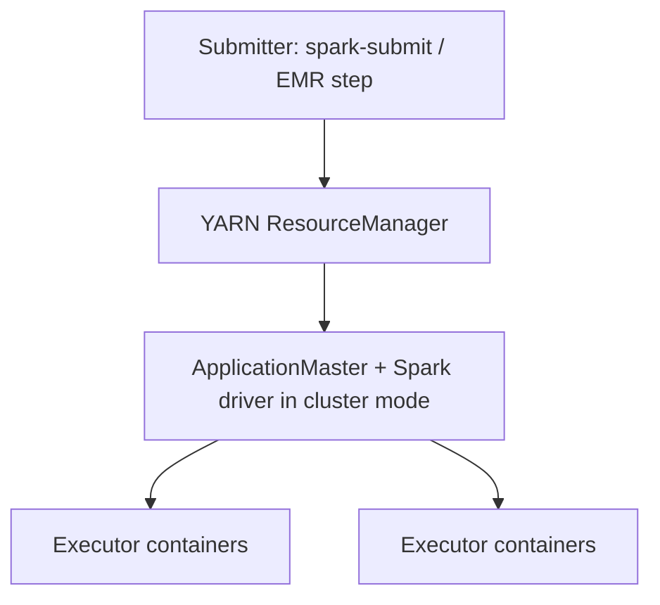

# Diagram — EMR / YARN + Spark (conceptual)

Where the **driver**, **ApplicationMaster**, and **executors** sit in a classic **YARN** deployment.

## Explanation

**Client mode** runs the **driver** on the submit host (risky for long jobs). **Cluster mode** runs
the driver on the cluster. **Executors** are **YARN** containers; limits apply to **JVM**, **Python
worker**, and **off-heap** overhead together.

## YARN + Spark (simplified)

**Production note:** **Spot** **task** nodes can be fine for **scan**-heavy work and awful for
**shuffle**-heavy work when reclamation shows up as `FetchFailedException`.

**Pairs with:** [`../docs/book/11-spark-on-yarn-and-emr.md`](../docs/book/11-spark-on-yarn-and-emr.md)
