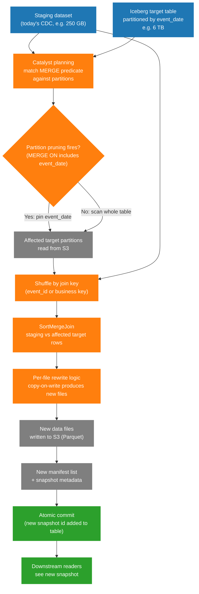

# Diagram — Iceberg `MERGE` On S3

What actually happens when a Spark job runs `MERGE INTO target USING staging` against an Iceberg table backed by S3. This diagram is what every engineer should have in mind before approving a merge job in design review.

## Explanation

An Iceberg `MERGE` is implemented as a join between the staging dataset and the affected partitions of the target. The output is a new set of data files plus a new manifest. The commit is a metadata change on the table — atomic, snapshot-isolated, and (in copy-on-write mode) it produces new files for any partition that had any matched or affected rows.

Two production rules to remember:

- A `MERGE` predicate that does not pin a partition column reads the entire table. The partition column in the `MERGE` ON clause is what enables Iceberg to prune target partitions.
- Copy-on-write `MERGE` rewrites every file that contained any matched row, even if only one row changed. File granularity dominates write cost.

## Iceberg MERGE Execution on S3

## How To Use This Diagram In The Relevant Chapter

Use this diagram in [Chapter 13 — Iceberg And Spark](../docs/book/13-iceberg-and-spark.md) and reference it in [Chapter 24 — Incremental Processing And Backfills](../docs/book/24-incremental-processing-and-backfills.md). It also pairs naturally with the [`emr-merge-memory-spill.md`](../docs/case-studies/emr-merge-memory-spill.md) case study.

The teachable points to anchor on the diagram:

- The `Pruning` node is the make-or-break decision for `MERGE` runtime. Pin the partition column in the `MERGE ON` clause or you read the whole table.
- The `JoinExchange` node is a real shuffle. Tens to hundreds of GB. This is what blows up if the merge scope grew silently.
- `PerFileLogic` produces *new* files for any partition with any matched row. This is why a one-row update can rewrite a 500 MB file.
- `AtomicCommit` is metadata-only. The expensive part is the data file rewrites that came before.

## Production Interpretation

- **Symptom: merge runtime grew over time**: usually a scope problem. The `MERGE` predicate started matching more partitions than it should — late-arriving data, a widened predicate, or a missing partition pin. Check `JoinExchange` shuffle bytes vs the original baseline.
- **Symptom: merge produces many small files**: the output partition count of the rewrite stage is too high. Tune `spark.sql.shuffle.partitions` or use Iceberg's write distribution mode (`hash` or `range`).
- **Symptom: merge OOMs on join**: the per-task working set on the `SortMergeJoin` exceeded memory. Either too few shuffle partitions, or one hot key (skew) on the merge join key. The merge-on-S3 case study walks through this exact pattern.
- **Symptom: merge job succeeds but downstream readers see old data**: caching or session-level state on the reader side is reading an older snapshot. Iceberg commits are atomic but readers must refresh.
- **Symptom: snapshot count grows unbounded**: every commit adds a snapshot. Without expiration, manifest list reads slow down. Schedule `expire_snapshots` and `remove_orphan_files` as table maintenance.

When designing a merge job, the diagram is your design-review checklist:

- Is the `MERGE ON` predicate pinning a partition column?
- Is the join key clean, well-typed, and not heavily skewed?
- Is the output write distribution mode set to produce reasonably-sized files?
- Is there a guardrail on shuffle bytes and on output file count?
- Is there a snapshot expiration policy?
