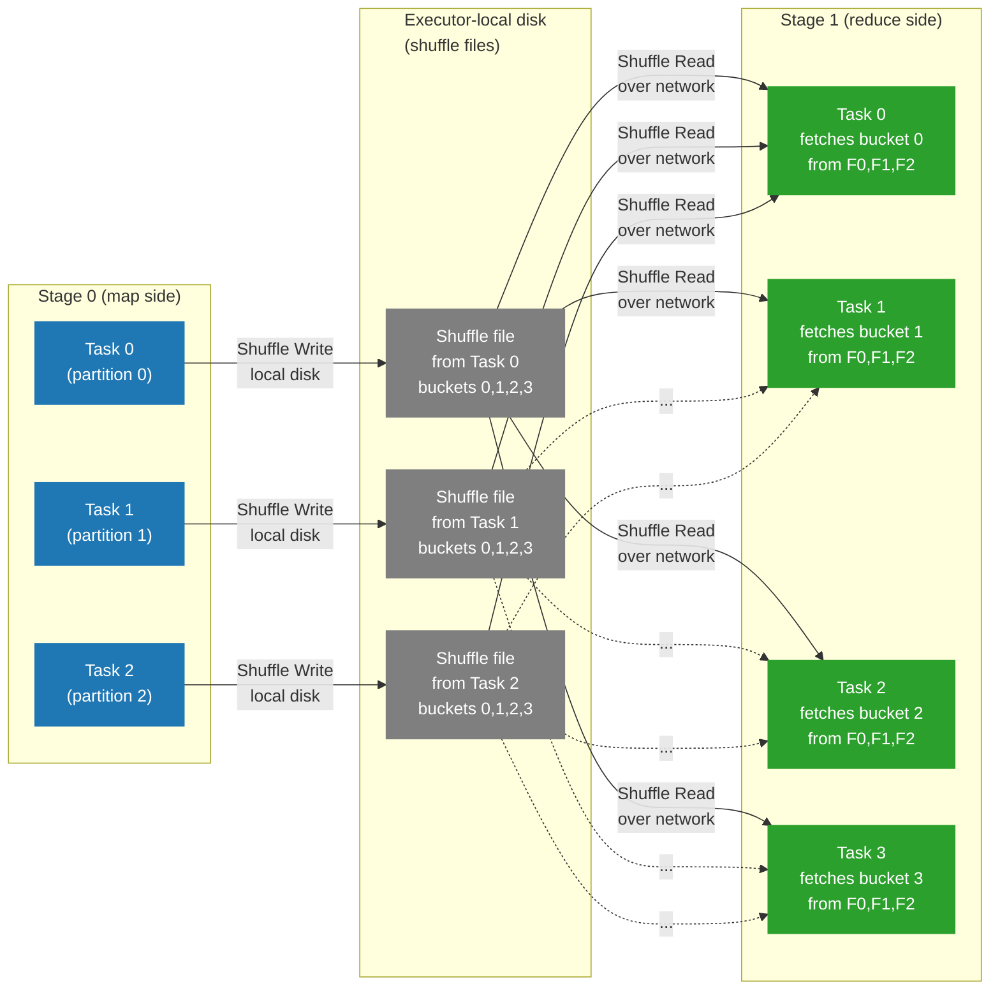

# Diagram — Shuffle Read And Write

Shuffles dominate cost and failure modes for most non-trivial Spark jobs. This diagram shows the map-side write and reduce-side read mechanics that the Spark UI's "Shuffle Read" and "Shuffle Write" columns refer to.

## Explanation

A **shuffle** redistributes intermediate data between two stages. The upstream stage writes shuffle output to local disk (one file per output partition per task). The downstream stage's tasks fetch the shuffle blocks they need over the network from the executors that wrote them, then continue processing.

Two production rules to remember:

- "Shuffle Write" in the Spark UI is **executor-local disk**, not S3 or HDFS. It is the temporary working set that the next stage will fetch.
- "Shuffle Read" is **remote** by default — the reducer pulls bytes from N executors. Network and the shuffle service determine throughput here.

## Shuffle Write and Shuffle Read Flow

## How To Use This Diagram In The Relevant Chapter

Use this diagram in [Chapter 2 — Shuffle And Performance](../docs/book/02-shuffle-and-performance.md) when introducing shuffle mechanics, and reference it in [Chapter 1 — Execution Model](../docs/book/01-execution-model.md) when introducing stage boundaries.

The teachable points to anchor on the diagram:

- Each map task writes one shuffle file with one bucket per future reduce partition.
- Each reduce task fetches its bucket from every map task. That fan-in is `O(num_map_tasks * num_reduce_tasks)` connections in the worst case.
- The Spark UI's "Shuffle Write" metric on Stage 0 equals the sum of bytes written to all the shuffle files. The "Shuffle Read" metric on Stage 1 equals the sum of bytes fetched.

## Production Interpretation

- A `FetchFailedException` means a reduce task tried to fetch shuffle bytes from an executor that is no longer there (lost executor, dead node, full disk). The diagram shows why this cascades: if `F0` disappears, every reduce task that needed bucket 0 from `F0` re-runs the upstream task.
- "Shuffle write" in the Spark UI does not mean S3. If shuffle write is high and S3 cost is low, the working set is on local executor disks. EMR core/task nodes use instance store or attached EBS for this; running out of local disk during shuffle is a common failure mode.
- AQE coalescing reduces the number of reduce tasks at runtime by merging small shuffle partitions. The diagram's right side becomes shorter — fewer reduce tasks, less fan-in.
- AQE skew join handling splits a single reduce bucket (say, bucket 0) into multiple tasks if the bucket is much larger than its peers. The diagram's right side has more tasks for the hot bucket only.
- For Spot instances: the loss of one map-side executor mid-stage forces re-execution of every map task that was running on it. On long shuffle stages this is why Spot is dangerous.

When you see "high shuffle bytes" in the Spark UI, the question is always: can we reduce the volume? Filters, projections, broadcast joins, semi-joins, and pre-aggregation are the levers — all of them reduce the bytes flowing through the diagram's middle column.
