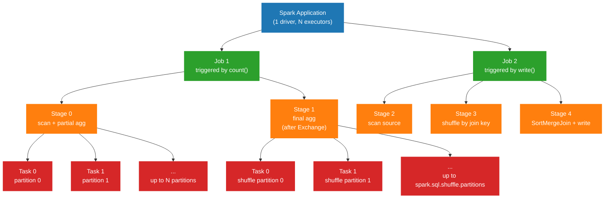

# Diagram — Spark Job, Stage, Task

The fundamental hierarchy in Spark execution. Reading this diagram is the prerequisite for every Spark UI investigation.

## Explanation

A Spark **application** is one running driver process. Inside the application, every action triggers one **job**. Each job is broken into **stages** at shuffle boundaries. Each stage runs many **tasks**, one per partition.

The hierarchy is:

- Application: 1 driver, N executors, N job runs over its lifetime.
- Job: 1 action -> 1 job. A job has one or more stages.
- Stage: a contiguous block of pipelined narrow transformations. Stages are separated by `Exchange` (shuffle) operators.
- Task: one partition's worth of work in one stage, executed on one executor core.

## Spark Job, Stage, and Task Hierarchy

## How To Use This Diagram In The Relevant Chapter

Use this diagram in [Chapter 1 — Execution Model](../docs/book/01-execution-model.md) when introducing the job/stage/task vocabulary.

When you introduce the diagram, anchor the three layers to their UI surfaces:

- Job = Spark UI **Jobs** tab.
- Stage = Spark UI **Stages** tab.
- Task = the rows in the Stages tab's "Tasks" panel.

Then point at the `Stage 0 -> Stage 1` edge and say: that arrow is the `Exchange`. That arrow is where Spark writes shuffle data to local disk and the next stage reads it back. Most production Spark performance problems live on that arrow.

## Production Interpretation

- A job with one stage is rare and usually means no shuffle — for example, a bare `df.write.parquet(...)` without aggregation or join.
- A job with 8+ stages usually reflects multiple shuffles — joins, group-bys, distinct, window operations. Each is a redistribution event with a real cost.
- The number of tasks per stage tells you the parallelism of that stage. Too few = under-utilized cluster. Too many = scheduler overhead and tiny output files.
- A job that runs many actions over the same DataFrame without caching causes repeated stages. The Jobs tab shows it as multiple jobs running the same lineage. That is usually a bug or a missing `cache()`.

When debugging, the diagnostic is always: pick the slow stage in the Stages tab, look at task distribution within that stage, and form a hypothesis from there. The job-level wall-clock time is the headline; the stage-level metrics are the evidence.
