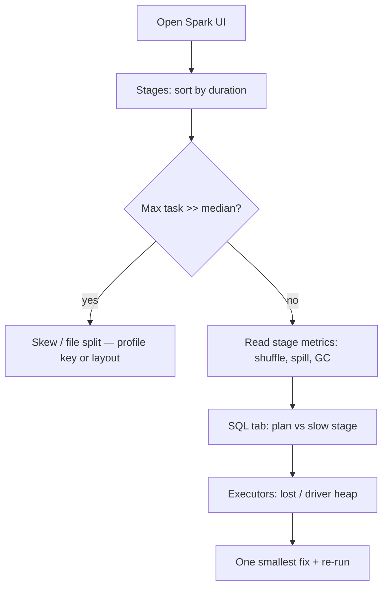

# Diagram — Spark UI triage flow

A **repeatable** order of tabs so you do not thrash during an incident.

## Explanation

Most slow jobs are **one stage** problems. **Stages** give you **task** shape; **SQL** maps to
**operators**; **Executors** rules out **cluster** health.

## Triage flow

**See:** [`../docs/observability/spark-ui-guide.md`](../docs/observability/spark-ui-guide.md),
[`../docs/troubleshooting/slow-job.md`](../docs/troubleshooting/slow-job.md)
