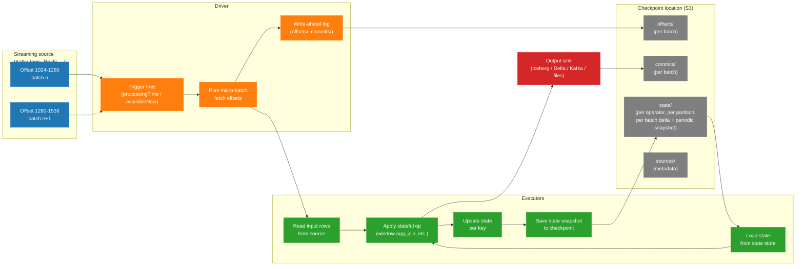

# Diagram — Structured Streaming Checkpoint And State

How Structured Streaming maintains state across micro-batches and how the checkpoint location ties together input progress, state snapshots, and output commits. This is the diagram every streaming engineer should be able to draw on a whiteboard.

## Explanation

A Structured Streaming query reads from a source (Kafka, files, Kinesis) one micro-batch at a time. For stateful operators (windowed aggregations, joins, `flatMapGroupsWithState`), Spark keeps a **state store** per partition, persisted to the **checkpoint location**. On every micro-batch:

1. Spark reads the next batch of input from the source.
2. Spark loads the state from the checkpoint into the executors.
3. Spark processes the batch, updating the state.
4. Spark writes the new state snapshot back to the checkpoint.
5. Spark commits the offset (so the next batch starts from the right place) and writes any output.

The checkpoint location is the durable single source of truth for "what has been processed and where are we." Lose the checkpoint and the streaming query has to start over from a configured starting offset.

## Structured Streaming Checkpoint and State Flow

## How To Use This Diagram In The Relevant Chapter

Use this diagram in [Chapter 14 — Structured Streaming](../docs/book/14-structured-streaming.md) when introducing checkpointing and state, and reference it in the [`streaming-state-blowup.md`](../docs/case-studies/streaming-state-blowup.md) case study.

The teachable points to anchor on the diagram:

- Every micro-batch *must* load state from the checkpoint, mutate it, and save it back. State size is therefore a per-batch latency cost.
- The checkpoint contains four logical things: `offsets/` (where we were), `commits/` (what we finished), `state/` (the working set for stateful operators), and `sources/` (source metadata). All four must be writable to make progress.
- The state store is keyed by the partition columns of the stateful operator (the `groupBy` key for an aggregation, the `keyBy` for `flatMapGroupsWithState`). State size scales with the number of distinct keys that have not yet been expired.
- The Spark UI's Streaming Query tab shows the time spent on each phase (`addBatch`, `walCommit`, `triggerExecution`) and per-operator state metrics (`numRowsTotal`, `numRowsRemoved`, `memoryUsedBytes`).

## Production Interpretation

- **Symptom: batch duration drifting up over weeks**: usually the state store is growing because state is not being expired. Watermark misconfiguration is the most common cause. Check `numRowsRemoved` on the state operators — if it is 0 every batch, state is unbounded.
- **Symptom: restart from checkpoint takes 20+ minutes**: the state snapshot is large and is being read from S3 into memory. Bounded state means bounded recovery time.
- **Symptom: high `walCommit` time**: writing offsets/commits to the checkpoint is slow. On S3 this can be the cost of listing a checkpoint directory with thousands of small files. Clean up old checkpoints; consider `spark.sql.streaming.minBatchesToRetain`.
- **Symptom: "checkpoint corruption"**: usually a job started with the same checkpoint location as another job, or two different versions of the code wrote incompatible state schemas. Each streaming query needs a unique checkpoint location.
- **Symptom: end-to-end freshness is degrading but processing rate is stable**: the watermark is lagging real time. Look at the diagram's `Process` and `StateUpdate` nodes — if state is growing without expiration, the cluster is doing more work per batch even though input volume is flat.

When designing a streaming job, the diagram is your design-review checklist:

- What is the checkpoint location? Is it unique to this query?
- What stateful operators are present? What is the watermark, and how does each operator use it?
- What is the expected steady-state state size? Has it been measured?
- What is the recovery time SLO (restart-from-checkpoint)? Has it been tested with a drill?
- Is the state store provider RocksDB (preferred for state >1 GB)?
- Is there a metric for state size growth, watermark lag, and batch duration drift?

The streaming case study walks through what happens when each of these is missing.
