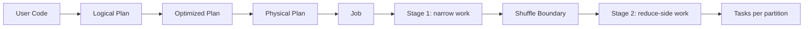

# Execution Model

Status: First Draft
Level: Senior to Staff
Covers: jobs, stages, tasks, drivers, executors, narrow transformations, wide transformations

## Core Idea

Spark turns a logical data computation into distributed work. A user writes transformations and actions; Spark builds a lineage graph, optimizes it, splits it into stages at shuffle boundaries, and runs many tasks across executors.

The useful production model is:

- Job: work triggered by one action.
- Stage: a set of tasks that can run without waiting for a shuffle boundary.
- Task: one unit of work over one partition of data.

## Mental Model

Transformations such as `select`, `filter`, and `withColumn` are lazy. They describe a plan but do not execute it. Actions such as `count`, `collect`, `write`, and `show` force Spark to materialize the plan.

Spark builds a DAG. Narrow dependencies can be pipelined because each output partition depends on a small number of input partitions. Wide dependencies require data from many upstream partitions to be redistributed, usually by key. That redistribution creates a shuffle and normally creates a new stage.



| Concept | Created By | Production Signal |
| --- | --- | --- |
| Job | An action such as `count`, `write`, or `collect` | End-to-end application work |
| Stage | A chain of work split by shuffle boundaries | Shuffle-heavy stages dominate runtime |
| Task | One partition of one stage | Skew shows up as slow or large tasks |

## What Spark Does Internally

When an action like `count()` runs, Spark:

1. Builds or reuses the logical plan.
2. Analyzes column and table references.
3. Optimizes the logical plan.
4. Chooses one or more physical plans.
5. Breaks the physical plan into stages.
6. Schedules tasks for each stage.
7. Runs tasks on executors.
8. Returns a result to the driver or commits output.

The number of tasks in a stage is usually driven by the number of partitions in that stage. For file scans, input splits and file partitioning matter. For shuffle stages, settings such as `spark.sql.shuffle.partitions` and Adaptive Query Execution matter.

## Why It Matters In Production

Most Spark failures and performance problems are easier to understand when you know whether the bottleneck is at the job, stage, or task level.

- Job-level issue: the full application is slow or failing.
- Stage-level issue: one shuffle, join, aggregation, or write dominates runtime.
- Task-level issue: skew, bad partition sizing, slow nodes, spill, or executor instability.

The driver owns scheduling, plan coordination, metadata, and result collection. If the driver dies, the Spark application usually fails. Executors run tasks and store shuffle or cached data. If an executor dies, Spark can usually retry its tasks, but shuffle data stored on that executor may need to be recomputed unless an external shuffle service or shuffle tracking is available.

## Common Failure Modes

- Driver OOM from `collect()`, huge query plans, too much metadata, or too many files.
- Executor loss from memory pressure, disk pressure, node failure, container preemption, or network instability.
- Long-tail stages where one task is much slower than peers.
- Excessive task overhead from too many tiny partitions.
- Underutilized cluster from too few partitions.

## Tuning And Configuration

Tune only after identifying the execution bottleneck.

- Increase parallelism when tasks are too large and cluster cores are idle.
- Reduce partition count when task overhead dominates.
- Avoid collecting large data to the driver.
- Use Adaptive Query Execution for runtime shuffle coalescing and skew mitigation.
- Size the driver for metadata-heavy workloads, especially jobs scanning many files or generating large plans.

## Spark UI Signals

Use the Spark UI to locate the level of the problem:

- Jobs tab: which action triggered work and how long it took.
- Stages tab: task counts, shuffle read/write, spill, locality, and long tails.
- SQL tab: physical operators, joins, exchanges, adaptive plan changes.
- Executors tab: failed tasks, memory use, disk spill, GC time, and executor loss.

## Best Practices

- Start debugging from the slowest stage, not from the top-level job duration.
- Read the physical plan when joins, aggregations, or writes are expensive.
- Treat `collect()` as a driver-memory operation, not a distributed operation.
- Track input size, output size, task count, shuffle size, and spill for production jobs.
- Keep transformations composable and inspectable so query plans remain understandable.

## Anti-Patterns

- Explaining Spark only as "parallel Python" or "parallel SQL."
- Tuning executor memory before finding the expensive stage.
- Calling many actions on the same expensive lineage without caching or checkpointing when reuse is intentional.
- Using `collect()` or `toPandas()` on production-size datasets.

## Example

```python
df = spark.read.parquet("s3://lake/events/")

daily = (
    df.filter("event_date = '2026-04-25'")
      .groupBy("customer_id")
      .count()
)

daily.write.mode("overwrite").parquet("s3://lake/customer_daily_counts/")
```

The filter can usually be pipelined with the scan. The `groupBy` requires rows with the same `customer_id` to meet in the same partition, so Spark inserts a shuffle and creates a new stage. The write stage then creates output files from the final partitions.

## Interview-Style Questions Covered

- Explain the difference between job, stage, and task in Spark.
- What causes Spark to create a new stage?
- What is a wide transformation vs a narrow transformation?
- Why do `groupBy`, `join`, and `distinct` usually cause a shuffle?
- What happens internally when you call an action like `count()`?
- How does Spark decide the number of tasks for a stage?
- What is the role of the driver?
- What is the role of the executor?
- What happens if the driver dies?
- What happens if one executor dies during a job?

## Real Use Case

A daily marketing attribution pipeline reads clickstream events, joins them to campaigns, groups by campaign and day, and writes aggregates. When the job slows down, a staff engineer checks the SQL tab and sees the aggregation stage consumes 80 percent of runtime because it shuffles hundreds of GB. The fix is not "add memory" first; the fix is to inspect key distribution, partition sizing, and whether the aggregation can be reduced earlier or written with a better table layout.
