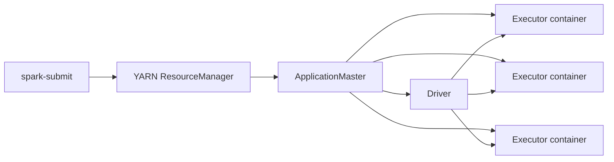

# Spark On YARN And EMR

Status: First Draft
Level: Senior to Staff
Covers: client mode, cluster mode, ApplicationMaster, containers, executor sizing, YARN logs

## Core Idea

Spark on YARN runs Spark applications inside YARN-managed containers. EMR commonly uses YARN for resource management, with Spark drivers and executors allocated from cluster capacity.

## Mental Model

In client mode, the driver runs where `spark-submit` is launched, such as an edge node, notebook host, or gateway. In cluster mode, the driver runs inside the cluster in an application container.

Client mode is convenient for interactive work but fragile for long production jobs. If the notebook or gateway loses connectivity, the driver may fail. Cluster mode is usually better for scheduled production jobs.

| Deploy Mode | Driver Location | Best For | Main Risk |
| --- | --- | --- | --- |
| Client | Submit host, notebook, gateway | Interactive debugging | Driver tied to client availability |
| Cluster | Cluster-managed container | Scheduled production jobs | Harder interactive debugging |



## What Spark Does Internally

During `spark-submit`, Spark packages configuration and dependencies, contacts YARN, starts an ApplicationMaster, allocates executor containers, launches executors, and schedules tasks.

YARN containers enforce memory and CPU limits. If executors exceed container memory, YARN can kill them even when Spark does not report a clean JVM OOM.

## Why It Matters In Production

The same Spark code can behave differently depending on deploy mode, queue capacity, executor sizing, dependency distribution, and YARN container limits.

Executor cores affect how many tasks run concurrently per executor. Executor instances affect total cluster parallelism. Too many cores per executor can increase memory contention; too few can create overhead and poor utilization.

## Common Failure Modes

- Notebook client mode driver dies mid-job.
- YARN kills containers for memory overhead violations.
- Executors wait for resources because the queue is full.
- Dependencies exist on the driver but not executors.
- Logs are scattered across YARN containers.

## Tuning And Configuration

On EMR, executor sizing depends on instance type, YARN overhead, daemon processes, workload memory needs, and desired parallelism. Avoid using all node memory for executors; leave room for OS and cluster services.

Practical sizing questions:

- How many cores per executor?
- How many executors per node?
- How much heap per executor?
- How much memory overhead?
- How many total concurrent tasks?
- Is the workload CPU-bound, memory-bound, IO-bound, or shuffle-heavy?

## Spark UI Signals

Use:

- Spark UI for stages, executors, SQL plans, and task failures.
- YARN ResourceManager for application state and queue pressure.
- YARN aggregated logs for container kill reasons.
- EMR steps and cluster logs for bootstrap, dependency, and environment issues.

## Best Practices

- Use cluster mode for scheduled production jobs.
- Size executors based on workload and instance shape.
- Keep dependency packaging reproducible.
- Use YARN queues for workload isolation.
- Preserve event logs for post-mortem debugging.

## Anti-Patterns

- Running critical batch jobs from an unstable notebook session.
- Maximizing executor cores without considering memory per task.
- Ignoring YARN kill messages and only reading Python stack traces.
- Using one shared queue with no guardrails.

## Example

```bash
spark-submit \
  --deploy-mode cluster \
  --master yarn \
  --executor-memory 8g \
  --executor-cores 4 \
  --conf spark.executor.memoryOverhead=2g \
  jobs/daily_orders.py
```

These values are placeholders. A production config must fit the EMR instance type, workload shape, and queue capacity.

## Interview-Style Questions Covered

- Difference between Spark client mode and cluster mode?
- Where does the driver run in client mode?
- Where does the driver run in cluster mode?
- Why can client mode fail from a notebook?
- What happens during `spark-submit`?
- What are ApplicationMaster and containers in YARN?
- How do executor cores affect parallelism?
- How do executor instances affect parallelism?
- How do you size executors on EMR?
- How do you debug failed Spark jobs from YARN logs?

## Real Use Case

A nightly EMR job fails only when launched from a notebook. The actual transformation is fine; the driver is running in client mode on the notebook host and dies when the session disconnects. Moving the job to `spark-submit --deploy-mode cluster`, storing event logs, and using a production YARN queue makes the run independent of the notebook lifecycle.
