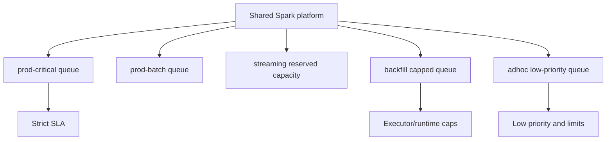

# Cluster And Workload Isolation

Status: First Draft
Level: Staff
Covers: workload separation, fair scheduling, YARN queues, Kubernetes quotas, guardrails, cost attribution

## Core Idea

Workload isolation prevents one Spark job, team, or workload type from degrading the platform for everyone else. A shared Spark platform needs scheduling policy, resource quotas, guardrails, and cost attribution.

## Mental Model

Interactive queries, batch ETL, streaming jobs, ad hoc exploration, and backfills have different reliability and latency needs. They should not all compete blindly for the same unrestricted resources.

| Workload | Needs | Isolation Control |
| --- | --- | --- |
| Streaming | Stable latency | Reserved capacity, careful autoscaling |
| Production batch | Predictable completion | Queue capacity and retries |
| Backfill | Large temporary capacity | Capped queue and off-peak windows |
| Ad hoc | Flexibility | Low priority and runtime limits |

## Platform Responsibilities

The platform should define:

- Queues or namespaces by workload type and priority.
- Executor, memory, core, and runtime limits.
- Autoscaling policies.
- Streaming resource reservations.
- Backfill isolation.
- Cost attribution by team or application.
- Alerts for abusive or runaway jobs.

## Why It Matters In Production

Without isolation, one large backfill can starve streaming jobs, one bad join can fill shuffle disks, and one team can consume most of the cluster budget.

## Common Failure Modes

- Shared cluster saturation.
- Streaming jobs miss SLAs because batch jobs consume resources.
- Interactive users wait behind long ETL jobs.
- Autoscaling reacts too slowly for latency-sensitive jobs.
- No team owns cost spikes.
- Large shuffle jobs fill local disks.

## Configuration And Controls

On YARN, queues and capacity/fair scheduling control resource allocation. On Kubernetes, namespaces, quotas, node pools, taints, tolerations, and priority classes can isolate workloads.

Spark-level guardrails include max executors, dynamic allocation bounds, memory limits, runtime limits, and job admission checks.

## Operating Signals

Monitor:

- Queue utilization.
- Pending applications.
- Executor allocation time.
- Streaming batch latency.
- Cluster CPU and memory utilization.
- Shuffle disk usage.
- Cost by team/application.
- Jobs exceeding guardrail thresholds.

## Best Practices

- Separate production, backfill, streaming, and exploration workloads.
- Reserve capacity for latency-sensitive pipelines.
- Enforce per-team limits.
- Use cost attribution to change behavior.
- Provide approved executor profiles.
- Review large backfills before execution.

## Anti-Patterns

- One shared queue for every workload.
- Unlimited dynamic allocation.
- Running massive backfills during business-critical windows.
- Optimizing cluster utilization while missing streaming SLAs.
- Measuring cost only at cluster level with no owner.

## Example

A platform can define separate queues:

- `prod-critical`: reserved capacity, strict deployment controls.
- `prod-batch`: scheduled ETL.
- `backfill`: capped resources and off-peak windows.
- `adhoc`: lower priority and runtime limits.

## Interview-Style Questions Covered

- How do you separate interactive, batch, streaming, and backfill workloads?
- What is fair scheduling in Spark?
- How do queues work in YARN?
- How do namespaces, node pools, and quotas work for Spark on Kubernetes?
- How do you prevent one team's Spark job from starving others?
- How do you set guardrails for executor count, memory, cores, runtime, and shuffle size?
- How do you design per-team cost attribution?
- How do you isolate high-priority pipelines from exploratory workloads?
- How do you manage autoscaling without hurting streaming or latency-sensitive jobs?
- How do you design cluster policies for a shared Spark platform?

## Real Use Case

A year-end backfill launches with unrestricted dynamic allocation and consumes most of the shared EMR cluster. Streaming jobs fall behind. The staff-level fix creates a capped backfill queue, reserves capacity for streaming, adds runtime and executor guardrails, and publishes cost by application owner.
