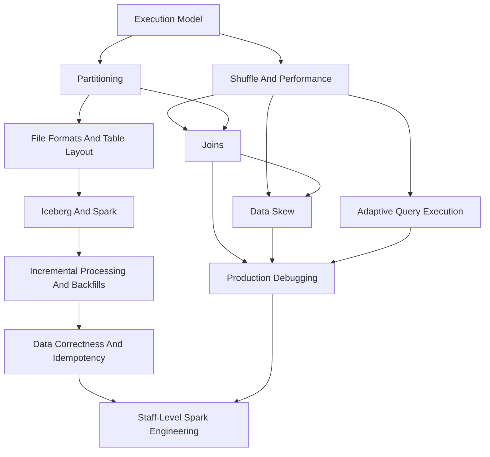

# Book

These chapters form the main Spark handbook. Each chapter should explain the mental model, Spark internals, production tradeoffs, tuning guidance, failure modes, Spark UI signals, best practices, anti-patterns, examples, and a real use case.

## How To Review A Chapter

Each chapter is designed for two reading modes:

| Mode | Use When | What To Scan |
| --- | --- | --- |
| Fast review | You are refreshing before an interview, design review, or incident | Core idea, mental model, diagram, production smells, best practices |
| Deep review | You are learning or writing production code | Internals, tuning, failure modes, Spark UI signals, example, real use case |

## Concept Dependency Map

## Visual Review Lanes

| Lane | Chapters | Main Question |
| --- | --- | --- |
| Execution | 1-6 | How does Spark break work apart and move data? |
| Runtime | 7, 10-12 | Why does the job fail or run slowly? |
| Storage | 8, 13, 17-19, 23 | How does data layout change scan, write, and planning cost? |
| Operations | 14-16, 20-22, 24-25 | How do we run Spark safely across teams and time? |

## Chapters

1. [Execution Model](01-execution-model.md)
2. [Shuffle And Performance](02-shuffle-and-performance.md)
3. [Partitioning](03-partitioning.md)
4. [Joins](04-joins.md)
5. [Data Skew](05-data-skew.md)
6. [Adaptive Query Execution](06-adaptive-query-execution.md)
7. [Memory Management](07-memory-management.md)
8. [File Formats](08-file-formats.md)
9. [Spark SQL And Catalyst](09-spark-sql-and-catalyst.md)
10. [Caching And Persistence](10-caching-and-persistence.md)
11. [Spark On YARN And EMR](11-spark-on-yarn-and-emr.md)
12. [Production Debugging](12-production-debugging.md)
13. [Iceberg And Spark](13-iceberg-and-spark.md)
14. [Structured Streaming](14-structured-streaming.md)
15. [Staff-Level Spark Engineering](15-staff-level-spark-engineering.md)
16. [Data Correctness And Idempotency](16-data-correctness-and-idempotency.md)
17. [Spark Write Path And Output Files](17-spark-write-path-and-output-files.md)
18. [Object Storage With Spark](18-object-storage-with-spark.md)
19. [Statistics And Cost-Based Optimization](19-statistics-and-cost-based-optimization.md)
20. [Dependency Management And Packaging](20-dependency-management-and-packaging.md)
21. [Security And Governance](21-security-and-governance.md)
22. [Testing And CI/CD](22-testing-and-cicd.md)
23. [Data Modeling And Table Design](23-data-modeling-and-table-design.md)
24. [Incremental Processing And Backfills](24-incremental-processing-and-backfills.md)
25. [Cluster And Workload Isolation](25-cluster-and-workload-isolation.md)
